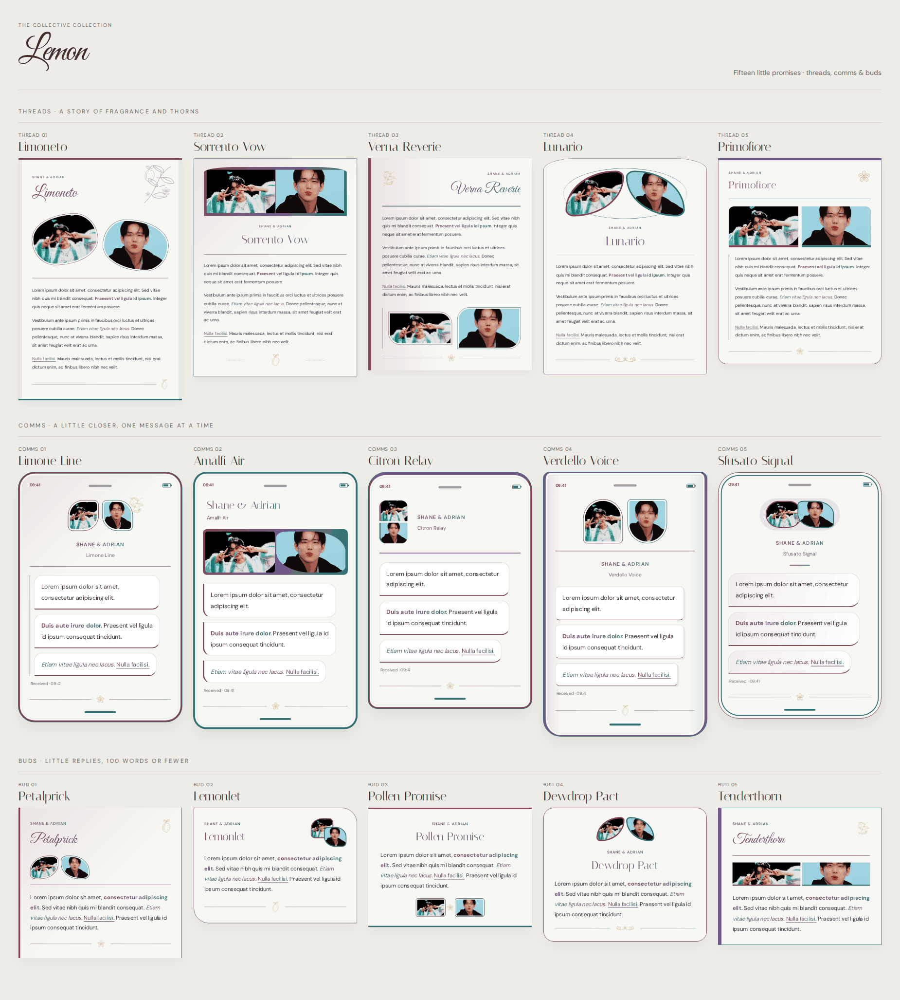

# Lemon collection

Fifteen JCink templates inspired by the Lemon poster: romantic lettering, lemon-shaped portraits, climbing branches, blossoms, and delicate thorn details. Member colours shape the headers, frames, borders, and emphasis. Writing rests on neutral light or dark backgrounds.

[Download the preview/editor](lemon-collection-preview.html) · [Complete collection ZIP](lemon-collection.zip)

| No. | Thread | Comms | Bud |
| --- | --- | --- | --- |
| 01 | [Limoneto](lemon-limoneto-thread-01.txt) | [Limone Line](lemon-limone-line-comms-01.txt) | [Petalprick](lemon-petalprick-bud-01.txt) |
| 02 | [Sorrento Vow](lemon-sorrento-vow-thread-02.txt) | [Amalfi Air](lemon-amalfi-air-comms-02.txt) | [Lemonlet](lemon-lemonlet-bud-02.txt) |
| 03 | [Verna Reverie](lemon-verna-reverie-thread-03.txt) | [Citron Relay](lemon-citron-relay-comms-03.txt) | [Pollen Promise](lemon-pollen-promise-bud-03.txt) |
| 04 | [Lunario](lemon-lunario-thread-04.txt) | [Verdello Voice](lemon-verdello-voice-comms-04.txt) | [Dewdrop Pact](lemon-dewdrop-pact-bud-04.txt) |
| 05 | [Primofiore](lemon-primofiore-thread-05.txt) | [Sfusato Signal](lemon-sfusato-signal-comms-05.txt) | [Tenderthorn](lemon-tenderthorn-bud-05.txt) |

## Copy and edit

Open any named `.txt` file, choose **Raw**, and copy the whole `[dohtml]` block into your post. The hosted stylesheet link is included. Editable names, URLs, titles, times, GIFs, and writing come before the final decoration and stylesheet. Posting snippets and CSS contain no comments, hidden tips, or editing instructions.

Replace `[url]` with your profile or thread link, `[name]` with your character name or names, and `[text]` with a title or status. Both supplied Tumblr GIFs and lorem ipsum are already filled in. Replace either GIF URL, remove one image line, or remove the entire GIF container. The image's `object-position` value adjusts its crop.

Download and open **lemon-collection-preview.html** in a browser to use the editor. Type tabs, named buttons, and Previous/Next expose every design. Each design retains its edits while the page stays open. Copy and Download produce the complete posting snippet. The preview includes palette tests, Light/Dark/System modes, GIF crop sliders, and a word count for buds. All original snippets are also available in the expandable collection below the editor.

Comms use ordinary `
` paragraphs: one paragraph is one message. Successive opening `
` tags work without closing tags. Set `data-direction="sent"` for outgoing bubbles, or keep `received` for incoming messages. Time and receipt text are editable at the top. The phone hardware is decorative. Bud samples contain fewer than 100 words; longer replies are never cut off.

The editor converts `[b]`, `[i]`, and `[u]` into `<b>`, `<i>`, and `<u>` for `[dohtml]`. In directly edited snippets, use the HTML tags. `<strong>` and `<em>` are also supported. Bold and underline follow the member gradient 1 → 2 → 3; italics reverse it to 3 → 2 → 1.

## Styling

Each posting snippet loads `lemon-collection-v1.css` through jsDelivr. No forum JavaScript, IDs, or manual stylesheet installation is required. Styles are scoped to `.lmn`. Blue Hour's inherited `--mgrgb1`, `--mgrgb2`, and `--mgrgb3` use comma-separated RGB values; preview palette settings never write fixed member colours into the copied code.

Blue Hour's explicit `html[color-mode="light"]` and `html[color-mode="dark"]` settings override the system preference. The system preference is used when the attribute is absent. Google Fonts supplies Italiana, Great Vibes, and DM Sans, with local fallbacks. The original lemon, blossom, branch, garland, and thorn drawings are SVG masks embedded in the CSS. The preview embeds its styling; online GIFs and fonts need an internet connection.

## Designs

- **Limoneto (thread):** Paired lemon-shaped portraits, a climbing branch, and a sweeping handwritten title.
- **Sorrento Vow (thread):** A formal portrait diptych above a centred invitation-style title and thorn-rule finish.
- **Verna Reverie (thread):** A text-first romantic page with a right-aligned script title and paired portraits below.
- **Lunario (thread):** Two leaf-lens portraits, curved orbit lines, and a tiny blossom garland.
- **Primofiore (thread):** A clean blossom masthead, colour-banded photographs, and a fine writing rule.
- **Limone Line (comms):** A botanical handset with leaf-cut contact portraits and a fine conversation rail.
- **Amalfi Air (comms):** A slim phone with an editorial contact name and a panoramic double-photo banner.
- **Citron Relay (comms):** A compact messenger phone with stacked contact thumbnails beside the name.
- **Verdello Voice (comms):** A ribbed-edge handset with opposing portrait curves and softly raised bubbles.
- **Sfusato Signal (comms):** A rounded phone with a paired portrait capsule and fluid message bubbles.
- **Petalprick (bud):** A tiny script-headed reply with petal portraits and a coloured edge.
- **Lemonlet (bud):** A compact curved note with two small portraits nestled beside the heading.
- **Pollen Promise (bud):** A little centred promise with a portrait-and-blossom signature below the reply.
- **Dewdrop Pact (bud):** Two miniature leaf lenses above a short reply and a delicate garland.
- **Tenderthorn (bud):** A slender botanical card with a script title and a tiny double GIF ribbon.
