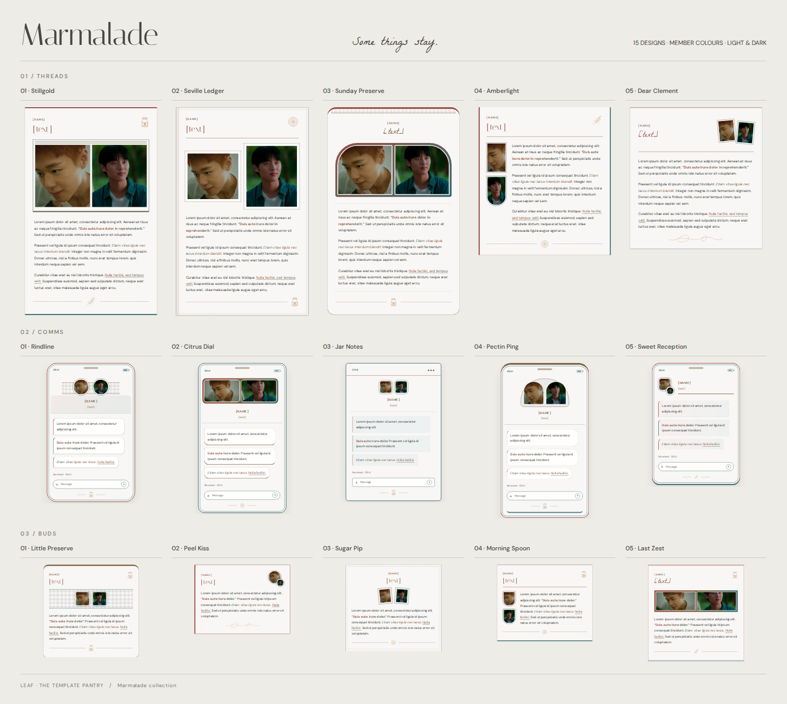

# Marmalade collection

Fifteen JCink templates inspired by the Marmalade poster: window light, handwritten keepsakes, preserve labels, gingham jar collars, and delicate citrus and botanical drawings. Member colours shape the headers, frames, borders, and formatted text; the writing rests on neutral light or dark surfaces.

[Download the preview/editor](marmalade-collection-preview.html) · [Complete collection ZIP](marmalade-collection.zip)

| No. | Thread | Comms | Bud |
| --- | --- | --- | --- |
| 01 | [Stillgold](marmalade-stillgold-thread-01.txt) | [Rindline](marmalade-rindline-comms-01.txt) | [Little Preserve](marmalade-little-preserve-bud-01.txt) |
| 02 | [Seville Ledger](marmalade-seville-ledger-thread-02.txt) | [Citrus Dial](marmalade-citrus-dial-comms-02.txt) | [Peel Kiss](marmalade-peel-kiss-bud-02.txt) |
| 03 | [Sunday Preserve](marmalade-sunday-preserve-thread-03.txt) | [Jar Notes](marmalade-jar-notes-comms-03.txt) | [Sugar Pip](marmalade-sugar-pip-bud-03.txt) |
| 04 | [Amberlight](marmalade-amberlight-thread-04.txt) | [Pectin Ping](marmalade-pectin-ping-comms-04.txt) | [Morning Spoon](marmalade-morning-spoon-bud-04.txt) |
| 05 | [Dear Clement](marmalade-dear-clement-thread-05.txt) | [Sweet Reception](marmalade-sweet-reception-comms-05.txt) | [Last Zest](marmalade-last-zest-bud-05.txt) |

## Copying and editing

Open a named `.txt` file, choose **Raw** on GitHub, and copy the entire `[dohtml]` block into your post. The stylesheet link is already included. Names, profile URLs, title/status text, both supplied GIF URLs, and the writing are at the top of each snippet. There are no comments or editing notes inside the templates.

Download and open `marmalade-collection-preview.html` to browse all 15 designs. Select Threads, Comms, or Buds, then a named design; Previous and Next cycle through the whole collection. Edit the fields and select **Copy JCink code** or **Download .txt**. Edits stay with each design while the page is open. The complete gallery also exposes every original snippet without JavaScript.

The editor accepts `[b]`, `[i]`, and `[u]`, or the equivalent HTML tags. Inside `[dohtml]`, use `<b>`, `<i>`, and `<u>`; `strong` and `em` are supported too. Bold and underline use the forward member gradient (1 → 2 → 3); italics use the reverse gradient (3 → 2 → 1). Comms use one ordinary `
` per message; closed paragraphs and successive opening `
` tags both work.

Both supplied Tumblr GIFs are included. Either GIF can be removed; the editor can omit both. The crop sliders adjust vertical framing. Replace `[name]` with a character name or names, `[url]` with a profile or thread link, and `[text]` with your title or status. All sample writing is lorem ipsum. Bud samples contain fewer than 100 words, and the editor counts words without cutting off longer replies. Phone controls are decorative.

## Styling

The forum snippets load `marmalade-collection-v1.css` from this repository through jsDelivr. No forum JavaScript, extra image assets, IDs, or one-time stylesheet installation is needed. The preview embeds this CSS so it opens locally; fonts and GIFs need an internet connection.

The inherited `--mgrgb1`, `--mgrgb2`, and `--mgrgb3` variables use comma-separated RGB values. Preview palette controls do not write fixed member colours into the posting code. Blue Hour's `html[color-mode="light"]` and `html[color-mode="dark"]` modes override the system preference; system mode is used when that attribute is absent. All template styles are scoped to `.mrm`.

Italiana, DM Sans, and La Belle Aurore are served by Google Fonts with local font fallbacks. Citrus slices, jars, peel curls, and botanical sprigs are original inline SVG masks included in the stylesheet. They need no external image host.

## Designs

- **Stillgold (thread):** Fine window frames, paired portraits, and a botanical finish.
- **Seville Ledger (thread):** A stitched preserve label with two keepsake photo stamps.
- **Sunday Preserve (thread):** A gingham jar collar, soft shoulders, and handwritten lettering.
- **Amberlight (thread):** A narrow portrait rail beside an intimate column of writing.
- **Dear Clement (thread):** A small correspondence card with photographs tucked into its corner.
- **Rindline (comms):** A classic handset with gingham contact trim and incoming bubbles.
- **Citrus Dial (comms):** A compact phone with a panoramic double portrait header.
- **Jar Notes (comms):** A desktop messenger window with tinted note-like bubbles.
- **Pectin Ping (comms):** A rounded handset with a tall contact window and soft chat bubbles.
- **Sweet Reception (comms):** A pocket messenger with overlapping avatars and a neat contact bar.
- **Little Preserve (bud):** A miniature jar label with a gingham portrait ribbon.
- **Peel Kiss (bud):** Two overlapping portrait coins and a delicate citrus-peel flourish.
- **Sugar Pip (bud):** A small stitched keepsake with two photograph stamps.
- **Morning Spoon (bud):** A slender portrait rail and a small space for a quick reply.
- **Last Zest (bud):** A handwritten heading, panoramic GIF strip, and tiny botanical finish.
