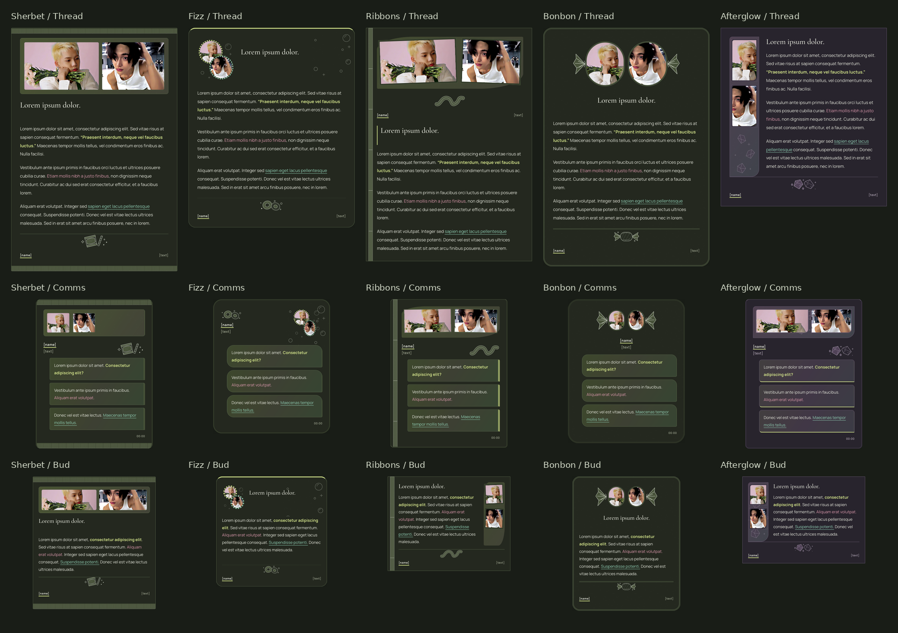

# Sour collection

Five named designs, each available as a thread, comms and bud: **15 templates** with the approved sour-candy details, compact editable titles and supplied character GIFs.

[Preview and editor](sour-collection-preview.html) · [Download the collection](sour-collection.zip)

Download and open the HTML preview in a browser to switch between all 15 templates, edit your text and GIFs, try member palettes or monochrome, and copy the finished posting code. The expandable gallery also contains every design and its code without requiring JavaScript.

| Design | Thread | Comms | Bud |
| --- | --- | --- | --- |
| Sherbet | [Thread](sour-sherbet-thread-01.txt) | [Comms](sour-sherbet-comms-01.txt) | [Bud](sour-sherbet-bud-01.txt) |
| Fizz | [Thread](sour-fizz-thread-02.txt) | [Comms](sour-fizz-comms-02.txt) | [Bud](sour-fizz-bud-02.txt) |
| Ribbons | [Thread](sour-ribbons-thread-03.txt) | [Comms](sour-ribbons-comms-03.txt) | [Bud](sour-ribbons-bud-03.txt) |
| Bonbon | [Thread](sour-bonbon-thread-04.txt) | [Comms](sour-bonbon-comms-04.txt) | [Bud](sour-bonbon-bud-04.txt) |
| Afterglow | [Thread](sour-afterglow-thread-05.txt) | [Comms](sour-afterglow-comms-05.txt) | [Bud](sour-afterglow-bud-05.txt) |

## Use on the forum

Open an individual `.txt` file, choose **Raw**, and copy its complete `[dohtml]` block. Keep the stylesheet link at the bottom. Each snippet uses the shared [sour-collection-v1.css](sour-collection-v1.css), served through jsDelivr; no board-wide CSS installation is needed.

Editable names, URLs, subtitles, the optional title, notes, timestamp, GIF URLs and crops, and reply text are at the top. Clearing the title removes it. Both supplied GIFs appear by default; the editor supports one or two.

Comms use one ordinary `
` per outgoing message. Successive opening `
` tags and fully closed paragraphs both work. Buds encourage replies of 100 words or fewer; the editor counter never truncates writing.

Bold and underline use the inherited `--mgrgb1`, `--mgrgb2`, `--mgrgb3` gradient in forward order; italics reverse it. These member colours also affect borders, portrait frames and appropriate surfaces. Use native `<b>`, `<i>` and `<u>` in `[dohtml]`; the editor converts `[b]`, `[i]` and `[u]` into HTML for you.

Explicit `html[color-mode="light"]` or `html[color-mode="dark"]` takes precedence over the system preference fallback. The monochrome editor option is a preview check and is not added to your posting code.

## Design details

- **Sherbet:** crimped sachet seams, sugar-speckled windows and dipping-stick illustrations.
- **Fizz:** sugar-coated gummy rings, fizzy bubbles and overlapping circular portraits.
- **Ribbons:** looped sour belts, sugar crystals and tilted frames.
- **Bonbon:** twisted wrapper ends, oval candy windows and sugar grains.
- **Afterglow:** faceted candy shards and crystalline portrait rails.

The candy illustrations are embedded in the stylesheet. Fonts use Google Fonts with system fallbacks; GIFs use the two supplied Tumblr URLs. The preview embeds the complete styling and uses the same posting snippets as the individual files.

